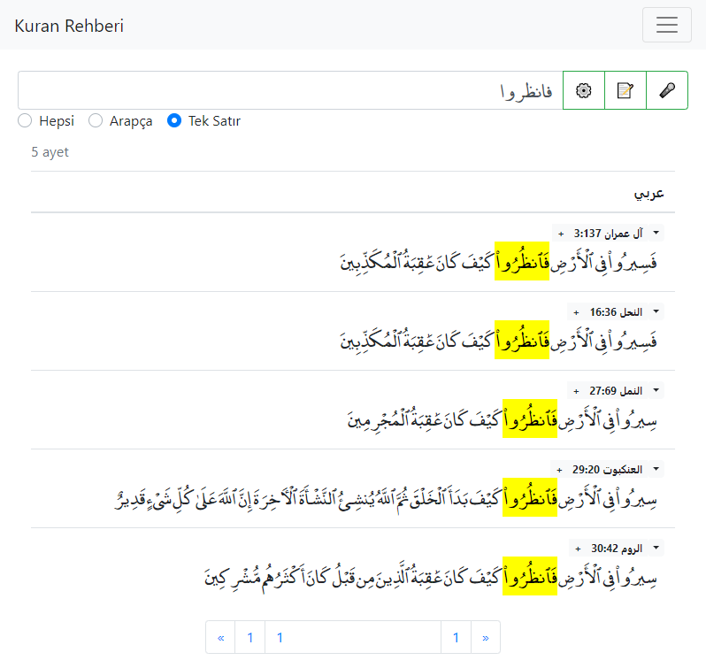
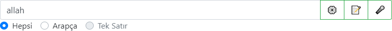
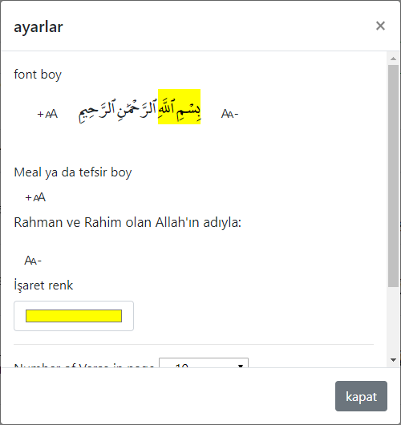
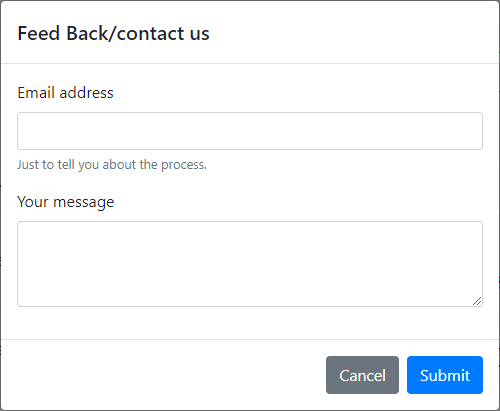
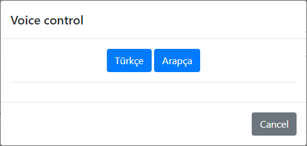
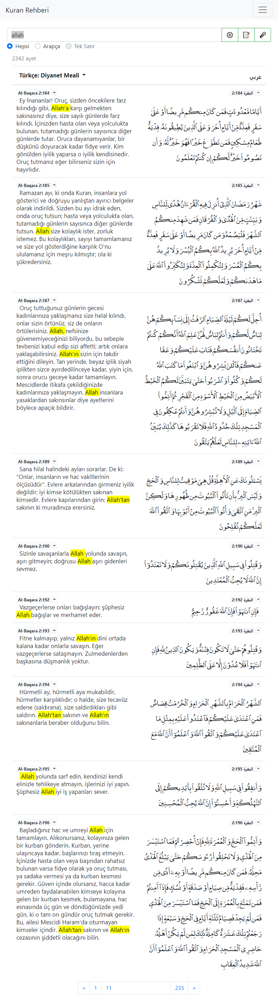
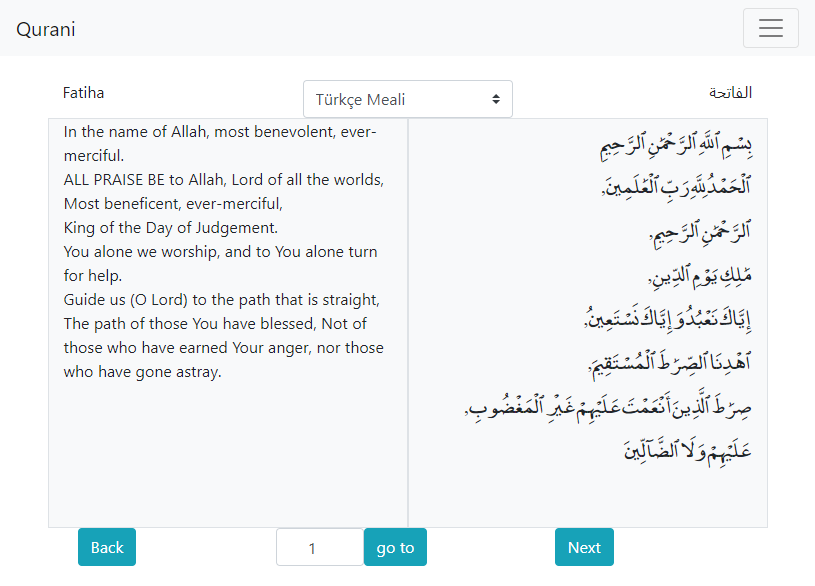
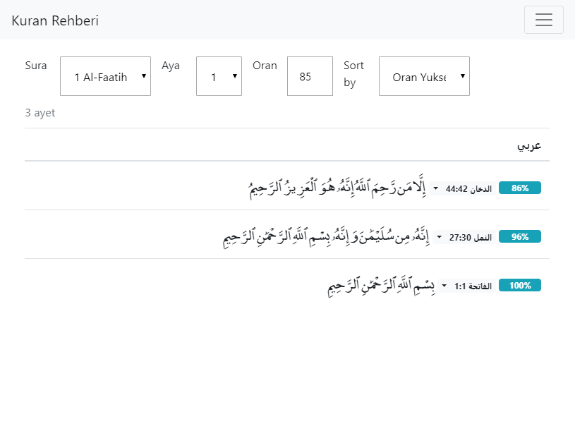
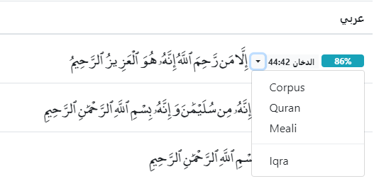

# Dalil'ul kuran
A program that help users to search in quran find verses and read it. 

## Sub Programs.
Bahis - A Quranic Search Engine.
Qurani - A program to read Quran.
Simi - A program to find similarity between verses in Quran. 

### Bahis
Program Page: [finder.html](../finder.html)

The search Engine have those features (for now):
   1. Query completetion 
   2. 3 Languages search (in Tafsir)
   3. Voice based Search
   4. one line mode
   5. direction to trusted websites
   6. User options
   7. multiword search
   8. Root Based search
   

You can read the next lines to understand the symbols in the program

⚙️ optins button:You can change the font size, colour and even the number of verses in page from this button.

📝 feedBack button: You can write us from here :).

🎤 Voice based search: if you are lazy to write, just use this one.

You can serach for multiwords by using "+" plus symbol in the program. 
(WIP...)

Furthermore you can add a word in the link to start searching by it like: 
[finder.html#w=الله](../finder.html#w=الله) Searching for allah word
[finder.html#t=allah](../finder.html#t=allah) searching for allah in Tafsir.

The results of Tafsir search.

### Qurani
Program webpage: [reader.html](../reader.html)
A program to read Quran online. - (WIP)

### Simi
Program webpage: [simi.html](../simi.html)

it finds the similar vers to your selected verse in the Quran.

Options: 
Sura: sura number 
Aya: verse number
Ratio: minimum ratio of similarity.
Sort by: Sort by verse or ratio - descent or ascent.

You can go to different sources as well by clicking on the right arrow of a verse

