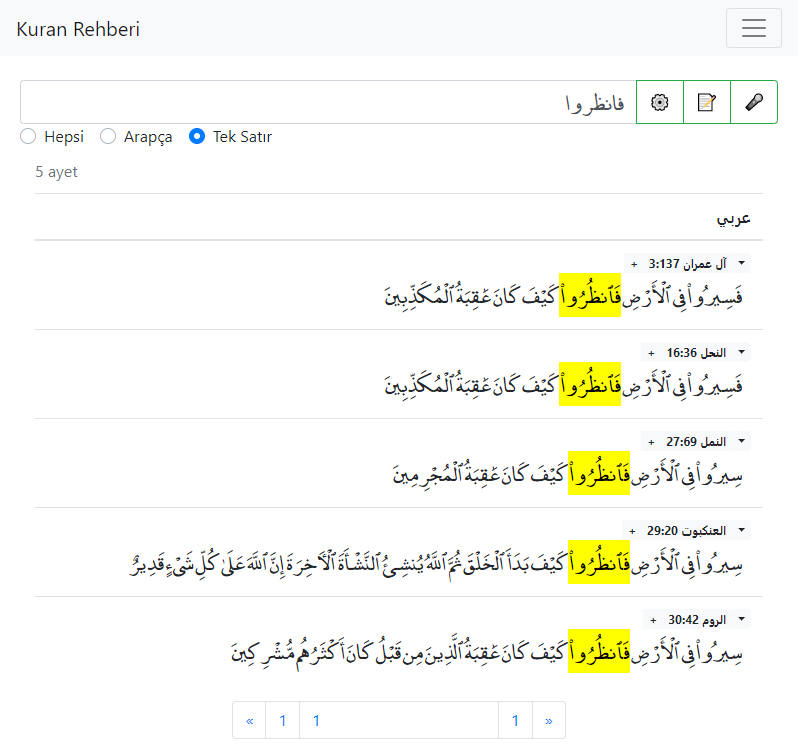
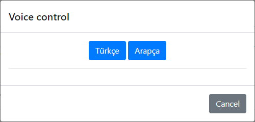
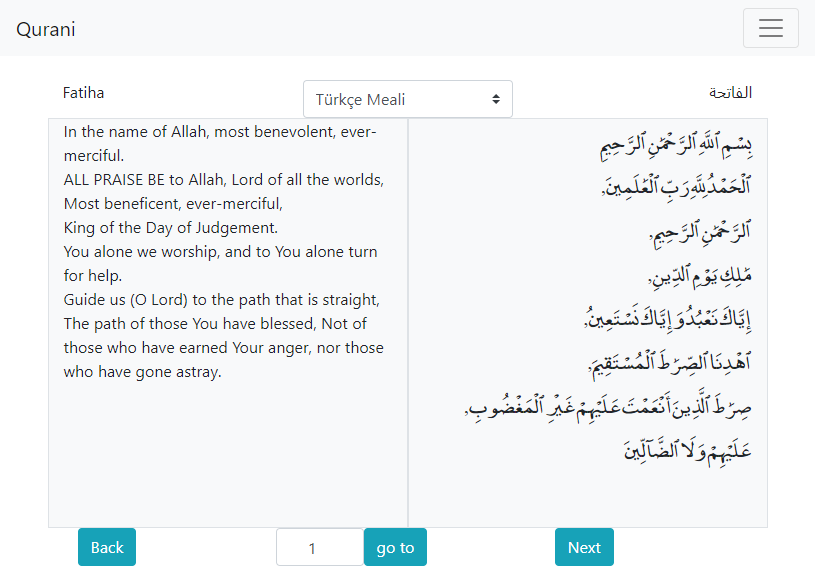

# Kuran Rehberi 
Kuran kerim okumasi ve incelemesi icin yapilan bir programdir. 

## Alt Yazilimlar.
Bahis - kuran da arama motoru
Qurani - kuran okuma yazilimi
Simi - benzerlik bazli arama motoru

### Bahis
Program sayfasi: [finder.html](../finder.html)
Kuranda arama motoru su anda var olan ozellikleri bunlardir: 
   1. kelime tamamlama
   2. 3 dil arama (tefsirede) 
   3. ses ile arama
   4. tek satir modu 
   5. baska sayfalara yonlendirme 
   6. Kullanici ayarlari 
   7. cok kelime arama 
   8. Kelime koku ile aramak 
   

Programda bulunan sembollere gore hareket edebilirsiniz: 

⚙️ ayarlar tusu: bu tusa basinca font ayarlari, rengi ve sayfada kac adet ayet gostermesini secebilirsiniz.

📝 geribildirim tusu: programciya geri bildirim vermeye dusunuyorsaniz hizli bir sekilde buradan verebilirsiniz.

🎤 ses ile aramak: buna basarak ses ile arapca ya da diger diller ile arama yapabilirsiniz.

Bir cok kelime aramaya istiyorsaniz kelimeler arasinda  "+" arti isareti ekleyere yapabilirsiniz.
(kontrol edilecek...)

Başlangıç adresinde arapca kelime ya da meal da kelime belirteyebilirsiniz.:

[finder.html#w=الله](../finder.html#w=الله) allah kelimesi ariyor
[finder.html#t=allah](../finder.html#t=allah) tefsirde allah kelimesine ariyor. 

Tefsirde arama ornegi: 

### Qurani
Program sayfasi: [reader.html](../reader.html)
Kuran okumasi ilgili bir program - (yapilmadi)

### Simi
Program sayfasi: [simi.html](../simi.html)

Kuranda secilen ayetleriin benzesenleri bulur ve benzeme orani gosterir ornegi:

Sayfayi gordugunuz gibi sure,ayet secerek diger ayetler ile benzerlik orani ve ayetleri gosterir size. 

oran ise: en az ne kadar benzemesi gostermesi lazim. 
sort ise var olan siralamalari yapiyor.

Bu sayfadan sagidaki ok tusuna basarsiniz ayni ayet bir cok kaynaktan acma sansi verir size.

